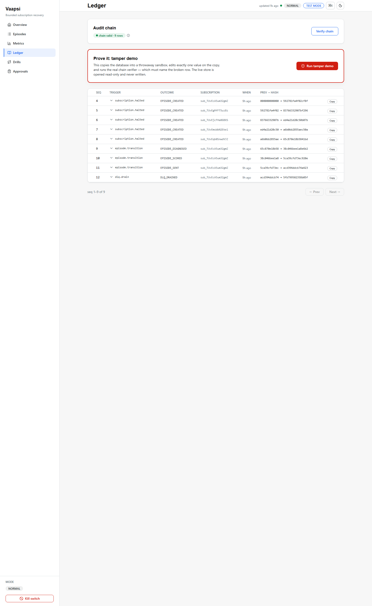
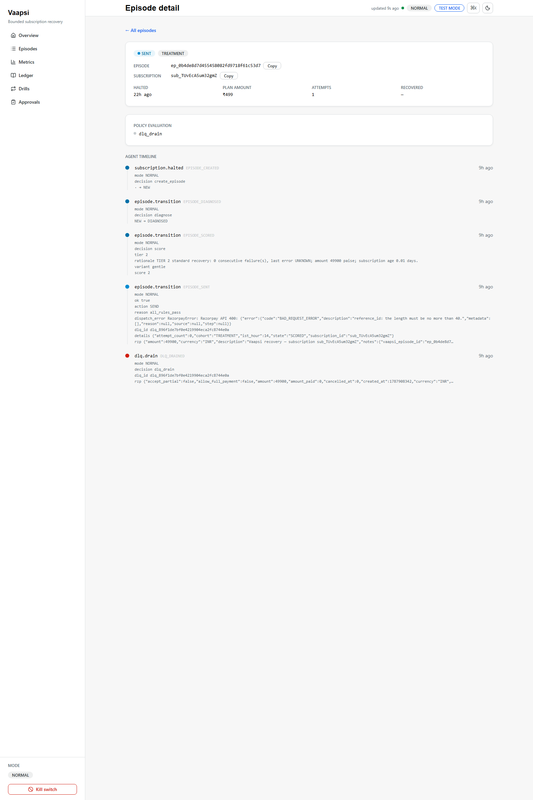

# Vaapsi

A recovery agent for failed Razorpay subscription charges. Test-mode APIs
only, built for the Razorpay AI Buildathon 2026 (Track 03).

**Live read-only demo:** https://vaapsi-6sdk.onrender.com/app — seeded
sanitized data, every write route disabled, and the boot refuses to start if
any provider credential is present. Free tier: the first load after ~15
minutes idle wakes the service in a few seconds.

When a subscription charge fails a few times, Razorpay halts the
subscription. The money is usually still owed; the customer just had an
expired card or a dry UPI mandate. Nobody chases it. Someone has to notice,
then email the customer, then hope. Vaapsi does that chase the boring way: a
rules engine decides whether and when to reach out, an LLM only picks the
wording and the channel, and every step lands in an append-only ledger.

> Recovering money is easy to demo and easy to fake. The hard part is
> proving you didn't message someone you shouldn't have. That proof is the
> product.

## Meeting the track bar

Track 03 lists four requirements. Here is where each one lives:

| The track asks for | Where it is |
|---|---|
| Webhook ingestion | `app/ingest/`, HMAC over raw bytes, idempotency keyed on event id, shape-adversarial payloads rejected 400 at the door |
| Payment link / checkout actions | `app/actions/recovery_link.py`, links stamped with the episode id in `notes`, dead-letter queue with drain-and-repair |
| Retry / dunning caps | `app/policy/`, 3 attempts, 6h cooling, 48h between outreaches, quiet hours 21:00–09:00 IST, stop-on-charge |
| Human in the loop for high value | `app/gates/`, every action above ₹500 waits for an approve/reject that only a human can give |

## Try it in two minutes

```bash
cp .env.example .env      # add your Razorpay test keys
make install
make run                  # dashboard at http://localhost:8000/app
```

No keys yet? The tests and the ledger verifier run fully offline:

```bash
make test                 # 364 backend tests + 28 frontend tests
make verify-chain         # replays the audit ledger, fails loudly on tamper
```

The dashboard ships pre-built in `frontend/dist/`, so you don't need node to
see it. There's also an older server-rendered version at `/dashboard`.

**The demo worth running:** open `/app/ledger` and click *Run tamper demo*.
It copies the store, edits one amount in the copy, and the verifier names
the row:

```text
tamper_detected: seq 4, field recovered_paise, expected 0, found 1
stored hash 592781fa… ≠ recomputed 3f9c22bd…   original store untouched
```

One edited field, caught by arithmetic. The original store stays valid the
whole time — `make verify-chain` before and after if you want to check.

## How it's put together

```text
webhook (HMAC verified, idempotent)
   → episode state machine
      → policy engine (plain Python, no LLM)
         → LLM picks {channel, message_variant} from an allowlist
            → payment link via Razorpay API
               → verify consumer watches for the payment
```

The LLM never decides anything that matters. It reads a diagnosis and
returns two fields from an allowlist in code. If the model is down, returns
garbage, or tries something outside the allowlist, the run continues with
fixed templates instead, and the ledger row says `DEGRADED`. The recovery
doesn't stop because the model did.

Every state change writes one row to an append-only SQLite ledger where each
row's hash covers the previous row's hash. The kill switch is engine-side:
one env flag and every outbound action refuses, regardless of what the
dashboard or the model wants.

## Screenshots







## Numbers so far

The experiment design was written down before any data was collected (see
`EXPERIMENT.md`): 60 test subscriptions, 30 get the agent (treatment), 30
don't (control), assigned alternately at creation time.

| Metric | Value | Note |
|---|---|---|
| Cohorts | 30 / 30 | assigned alternately at creation |
| Halt events | 15 | includes 6 flushed from Razorpay's retry queue after a dispatcher stall |
| Episodes opened | 5 | 1 outreach sent, 4 waiting on their policy window |
| Outreach to already-charged subs | 0 | checked against stop events in the ledger |
| Recovered | ₹0 | one live link created, not paid yet |

Small cohort, one plan, seven-day window, test mode throughout. The full
table with final denominators lands in `RESULTS.md` before submission.

## Offline pipeline evaluation

A committed, reproducible offline evaluation of the decision pipeline
(`make eval`): 200 synthetic halted-subscription cases across 16 failure
families, four arms over the same corpus, a documented synthetic outcome
model. Clearly not real money, no real outreach, the live data store is
never opened. Every case runs in a throwaway temp-dir SQLite store and each
arm's ledgers are hash-chain-verified afterwards. The numbers below are a
drift-guard contract: `python scripts/verify_numbers.py` fails CI if this
block and `results/evaluation.json` ever disagree.

<!-- eval:start -->
seed 1403, 200 cases, 16 families, synthetic outcome model - not real money

| arm | attempts | recovered | recovery_rate | 95% Wilson CI | oracle_gap |
|---|---|---|---|---|---|
| full_llm | 86 | 43 | 0.5000 | [0.3966, 0.6034] | -0.1650 |
| no_agent | 200 | 32 | 0.1600 | [0.1157, 0.2171] | 0.1750 |
| random_allowlist | 86 | 42 | 0.4884 | [0.3855, 0.5922] | -0.1534 |
| rules_only | 86 | 40 | 0.4651 | [0.3635, 0.5698] | -0.1301 |

Invariants: zero false outreach in every pipeline arm, every arm's ledger
chain verifies, seed pinned. The three pipeline arms route identically (the
LLM flavors, the rules decide); the recovery draw is per (case, arm), so the
residual spread between them is sampling noise, not signal.
<!-- eval:end -->

An agent without the rules layer is the `no_agent` row. The distance between
that row and the others is the whole argument for bounded autonomy.

## What went wrong

- Razorpay's webhook dispatcher went quiet for hours mid-experiment. The API
  accepted every halt from my side, but no webhook ever arrived. Diffing
  Razorpay's API against my table showed the gap; deleting and recreating
  the webhook fixed it, and events flowed again within a minute. Six halts
  flushed in from the retry queue afterward, and idempotency absorbed them.
- The first outreach dispatch died on a Razorpay 400: reference_id is capped
  at 40 characters and mine was 43. The error is still in the ledger and
  rendered on the episode timeline. I truncated the id, repaired the
  payload, and drained it from the dead-letter queue.
- I killed the LLM mid-episode on purpose. The run switched to templates in
  about four seconds and still completed the action. The ledger row says
  DEGRADED.
- A 16-attack adversarial gauntlet (replay storms, forged signatures, prompt
  injection, ledger surgery, kill-switch races) found one real defect: a
  malformed-but-validly-signed payload crashed the receiver with a 500
  instead of rejecting with a 400. Fixed, and the gauntlet now runs 16/16
  with its scorecard committed at `results/gauntlet_scorecard.json`.

## Layout

```text
app/
  ingest/      webhook receiver (HMAC, idempotency, shape validation) + consumers
  core/        episode state machine
  policy/      the rules engine (caps, cooling, quiet hours, gates, fencing)
  llm/         allowlisted client + degraded fallback
  actions/     payment-link dispatch, dead-letter queue, failure classifier
  gates/       human approval
  audit/       hash-chained ledger + verifier
  dashboard/   JSON API, React app at /app, older Jinja pages at /dashboard
tests/         364 tests + 28 frontend tests + 16-attack gauntlet
chaos/         failure drills (replay storms, fake 5xx, dead LLM)
EXPERIMENT.md  the cohort design, written before any data
SAFETY.md      every hard bound with its proving test
WHAT_BROKE.md  ten published failures with root causes and fixes
THREAT-MODEL.md  non-capabilities table: why each danger has no code path
DECISIONS.md   the calls that shaped the build, with rejected alternatives
VERIFY.md      every headline claim → artifact + command
RESULTS.md     live experiment counts, regenerated from the ledger
demo-evidence/ green/red paired transcripts
```

## Scope

Test mode only, no real money. Outreach is logged rather than delivered,
since test mode doesn't send real SMS or email. The agent only collects what
a merchant is already owed and it does nothing else. What it deliberately
has no code path for: customer communication outside the dispatched link,
amounts above the invoice's outstanding value, actions without a policy
verdict, and anything at all once the kill switch is set.

## CI


Every push and pull request runs three jobs: the Python suite (ruff +
pytest), the frontend (vitest + a production build), and the drift-guard
that checks the published evaluation numbers against the committed JSON.
No secrets are used. Everything runs offline against seeded stores.
