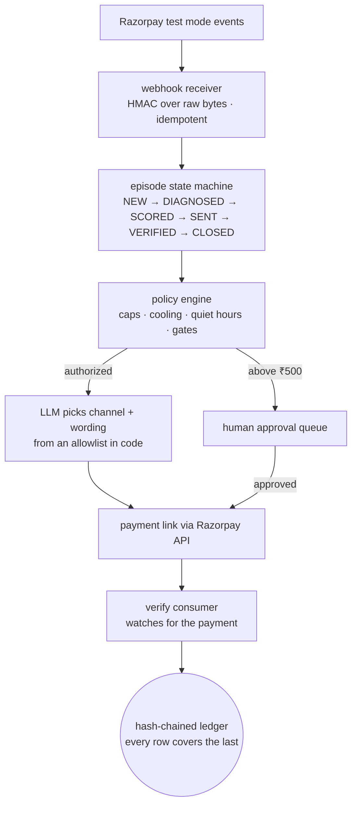
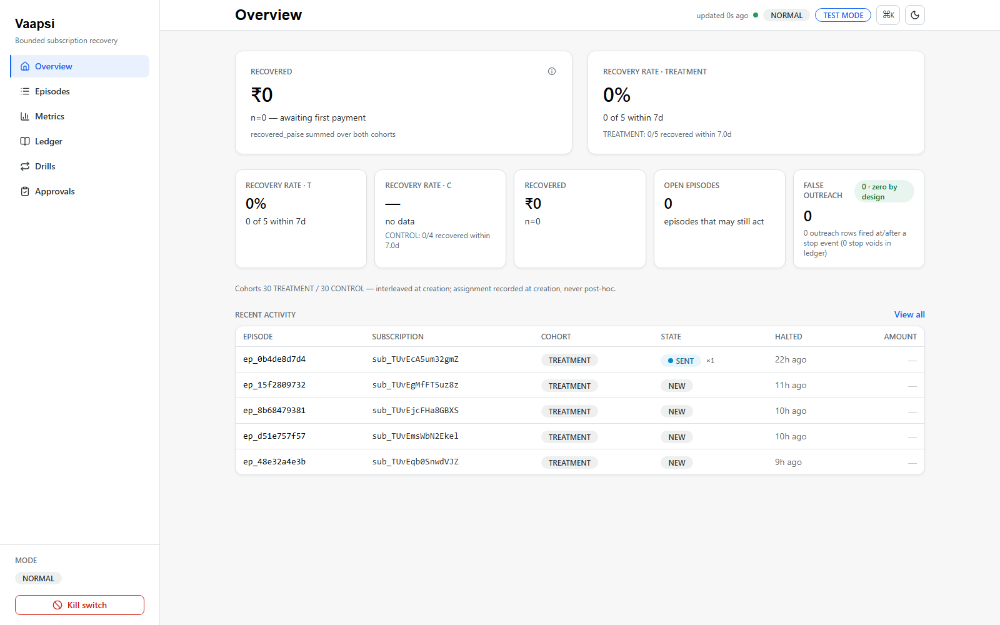
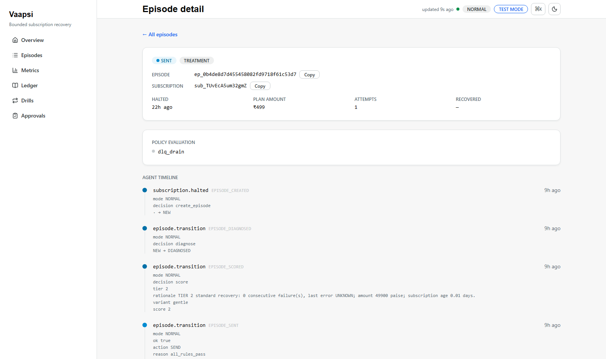
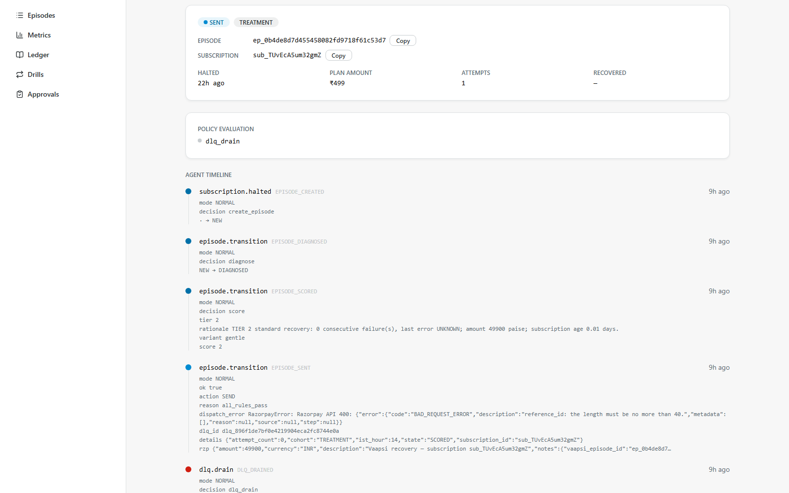
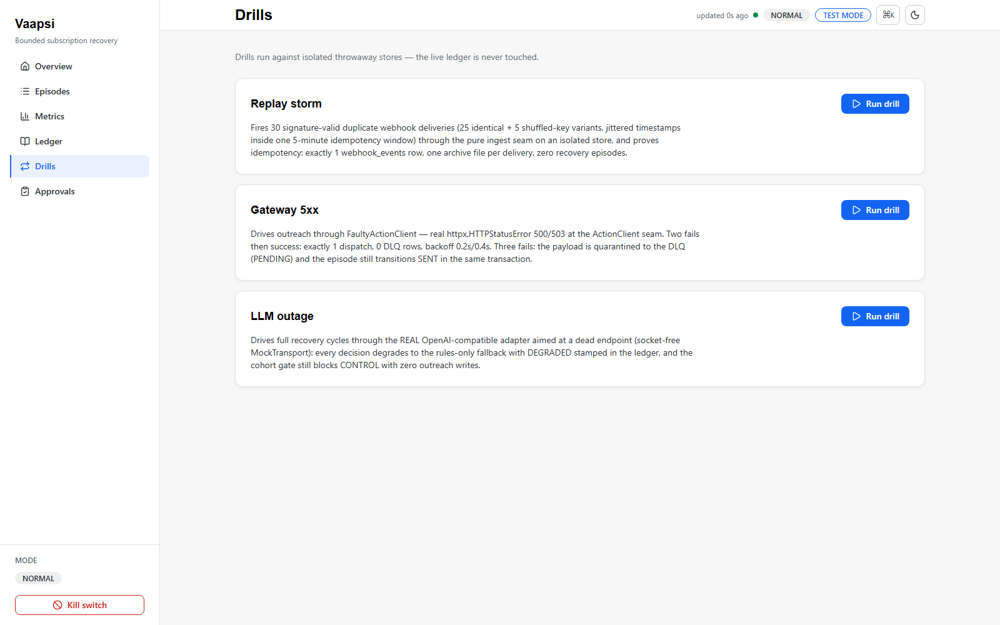
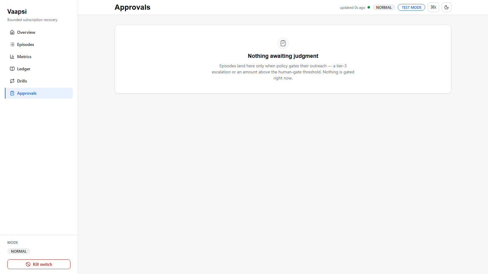

# Vaapsi

Recovery agent for failed Razorpay subscription charges. The rules engine
decides, the LLM only words the message, and every step lands in a
tamper-evident ledger. Built for the Razorpay AI Buildathon 2026, Track 03.

> Everyone is teaching agents to recover money. Vaapsi is the proof they
> didn't message anyone they shouldn't have.

**Live read-only demo:** https://vaapsi-6sdk.onrender.com/app — seeded
sanitized data, every write route disabled, boot refuses with any provider
credential present. Free tier: first load after ~15 min idle wakes the
service in a few seconds.

| measured | live run, test mode |
|---|---|
| Subscriptions instrumented | 60 (30 agent / 30 control) |
| Halt events ingested | 15 |
| Outreach to already-charged customers | **0** |
| Recovered so far | ₹0, one live link awaiting payment |

**Evidence in this README comes in three kinds, labeled as such:**
`LIVE` — the test-mode run above, real Razorpay API traffic. `EVAL` — the
offline 200-case pipeline evaluation, synthetic by design. `SCREENSHOT` —
renders of the dashboard. Nothing in this file mixes the three.

## Why this needs proving

A failed payment is not automatically recoverable revenue. It may already
have succeeded; a platform retry may still be in flight; the customer may
have escalated a dispute. An unbounded agent makes each of these worse:

- it acts on stale webhook state and chases money already captured;
- it contacts customers repeatedly, because more messages read as more effort;
- it takes high-value financial actions with nobody watching;
- it claims recovery before any money moved.

The rules below exist because each of those is a real way to lose a
customer, or a real way to look busy while recovering nothing.

## What broke, and how I got out

Four real failures from the build, each fixed and left visible in the
ledger. (The form asked for this first, so it's first here too.)

**Razorpay's webhook dispatcher went silent for hours.** The API accepted
every halt on my side; no webhook arrived. Diffing Razorpay's API against my
own table showed the gap: the events existed there and nowhere in my store.
Deleting and recreating the webhook fixed it; six halts flushed in from
their retry queue, and idempotency absorbed all six.

**The first outreach died on a Razorpay 400.** `reference_id` is capped at
40 characters; mine was 43. The error, the retry, and the repair are all
still rendered on the episode timeline. I truncated the id, repaired the
payload, drained the dead-letter queue, and the same link went out.

**I killed the LLM mid-episode on purpose.** The run switched to fixed
templates in about four seconds and completed the action anyway. The ledger
row says `DEGRADED`.

**My own gauntlet caught a defect in my own receiver.** A malformed but
validly-signed payload crashed the receiver with a 500 instead of rejecting
with a 400. Fixed, and the 16-attack gauntlet now runs 16/16 with the
scorecard committed at [`results/gauntlet_scorecard.json`](results/gauntlet_scorecard.json).

## The batch, measured

The track bar asks for measured money recovered across a batch, with
compliant escalation, stopping rules, and an audit trail. The design was
written down before any data existed ([EXPERIMENT.md](EXPERIMENT.md)): 60
test subscriptions, 30 get the agent, 30 get Razorpay's default retries
only, assigned alternately at creation.

| Metric | Value | Provenance |
|---|---|---|
| Cohorts | 30 / 30 | assigned alternately at creation, `data/cohort_manifest.csv` |
| Halt events | 15 (9 produced episodes) | webhook archive, HMAC-verified |
| Episodes opened | 5; 1 outreach sent, 4 inside their policy window | episodes table |
| Stopping rules | 3 attempts · 6h cooling · 48h between outreaches · 21:00–09:00 IST quiet · ₹500 human gate | [SAFETY.md](SAFETY.md), frozen constants with proving tests |
| Outreach to already-charged subs | 0 | SQL against stop events in the ledger |
| Recovered | ₹0 (one link live, unpaid) | ledger `recovered_paise` |

Reproduce the counts from a fresh clone: `make verify-chain` replays the
audit ledger; the dashboard recomputes every metric from the store on load.

## How the loop works, and who owns each step

| Stage | Owner | What happens |
|---|---|---|
| Ingest | Deterministic | HMAC over raw bytes, idempotency on event id, shape validation |
| Diagnose | Deterministic | failure classified from bounded webhook evidence |
| Score | Deterministic | tier assigned from amount, failure history, age |
| Decide | Deterministic | policy engine: caps, cooling, quiet hours, cohort |
| Word | AI | model picks channel + message variant from an allowlist in code |
| Approve | Human | everything above ₹500 waits for approve/reject |
| Execute | Governed | payment link created via Razorpay API, payload archived |
| Verify | Deterministic | `payment_link.paid` matched by notes round-trip, amount checked |
| Attribute | Deterministic | one recovery stamped once, or nothing |



The one-line version: the model reads a diagnosis and returns two fields.
Both come from an allowlist in code. It never decides whether to act, never
holds credentials, never calls Razorpay, cannot invent an amount, and its
stale proposals are discarded when the subscription state moved underneath
them. If it dies, returns garbage, or steps outside the allowlist, the run
continues on fixed templates and the ledger says so.

AI does not: decide financial truth, set retry timing, bend a cap, approve
itself above ₹500, or recover anything on its own authority.

Every state change appends one row to a SQLite ledger where each row's hash
covers the previous row's hash. `make verify-chain` replays it and fails
loudly if anything moved. The kill switch is engine-side: one env flag and
every outbound action refuses, no matter what the dashboard or the model
says. Public demo mode goes further: the boot refuses to start if any
provider credential is present, the webhook receiver is never mounted, and
every write route 404s.

## Offline pipeline evaluation

A committed, reproducible offline evaluation of the decision pipeline
(`make eval`): 200 synthetic halted-subscription cases across 16 failure
families, four arms over the same corpus, a documented synthetic outcome
model. Not real money, no real outreach, the live store never opened. Each
case runs in a throwaway temp-dir SQLite store and every arm's ledger is
hash-chain-verified afterwards. The numbers below are a drift-guard
contract: `python scripts/verify_numbers.py` fails CI if this block and
[results/evaluation.json](results/evaluation.json) ever disagree.

<!-- eval:start -->
seed 1403, 200 cases, 16 families, synthetic outcome model - not real money

| arm | attempts | recovered | recovery_rate | 95% Wilson CI | oracle_gap |
|---|---|---|---|---|---|
| full_llm | 86 | 43 | 0.5000 | [0.3966, 0.6034] | -0.1650 |
| no_agent | 200 | 32 | 0.1600 | [0.1157, 0.2171] | 0.1750 |
| random_allowlist | 86 | 42 | 0.4884 | [0.3855, 0.5922] | -0.1534 |
| rules_only | 86 | 40 | 0.4651 | [0.3635, 0.5698] | -0.1301 |

Invariants: zero false outreach in every pipeline arm, every arm's ledger
chain verifies, seed pinned. The three pipeline arms route identically (the
LLM flavors, the rules decide); the recovery draw is per (case, arm), so the
residual spread between them is sampling noise, not signal.
<!-- eval:end -->

The honest reading: the agent does not beat the rules engine; the rules
*are* the agent, and the model only trims the wording. The distance between
`no_agent` and everything else is what bounded autonomy buys. What the model
choice is worth lives in [DECISIONS.md](DECISIONS.md).

## What one episode looks like in the audit trail

Real rows from the store (test-mode ids), exactly as the ledger holds them:

| seq | outcome | note |
|---|---|---|
| 4 | EPISODE_CREATED | from `subscription.halted` |
| 9 | EPISODE_DIAGNOSED | |
| 10 | EPISODE_SCORED | tier 2, gentle variant |
| 11 | EPISODE_SENT | payload carries `dispatch_error` (Razorpay 400, reference_id too long) |
| 12 | DLQ_DRAINED | same payload, id repaired, link delivered |

Each row also stores the full policy evaluation, the exact Razorpay request
bytes, and the hash pair linking it to the previous row. `make verify-chain`
replays all of it.

## Run it

Python 3.11+, Node 22+ for the frontend build (the built SPA ships in the
repo, so the backend alone is enough to demo).

```bash
git clone https://github.com/krishnav0411/vaapsi.git
cd vaapsi
cp .env.example .env      # add your Razorpay test keys
make install
make run                  # dashboard at http://localhost:8000/app
```

No keys? Everything below runs offline:

```bash
make test                 # 364 backend tests + 28 frontend tests
make eval                 # rebuilds the 200-case evaluation
make verify-chain         # replays the audit ledger
```

The demo worth running needs no keys either: open `/app/ledger`, click
*Run tamper demo*. It copies the store, edits one amount in the copy, and
the verifier names the row:

```text
tamper_detected: seq 4, field recovered_paise, expected 0, found 1
stored hash 592781fa… ≠ recomputed 3f9c22bd…   original store untouched
```

One edited field, caught by arithmetic. `make verify-chain` before and after
if you want the original store's word for it.

## API surface

Read routes (all GET): `/health` · `/api/overview` · `/api/episodes` ·
`/api/episodes/{id}` · `/api/metrics` · `/api/mode` · `/api/policy` ·
`/api/ledger` · `/api/ledger/{seq}` · `/api/ledger/verify` ·
`/api/approvals/pending` · `/api/drills`. The React dashboard consumes
these at `/app`; a judge can walk the whole store with curl and no keys.

Write routes are the guarded ones: `POST /webhooks/razorpay` (HMAC over the
exact raw body, idempotency on event id), `POST /api/kill` (requires
`confirm: KILL`), `POST /api/approvals/{id}/decide`, `PUT
/api/policy/{merchant_id}` (DEFAULT row refuses 403), `POST
/api/drills/{id}/run` (isolated store only), and the tamper-demo endpoint
(copy-only). In public demo mode every one of these 404s —
the webhook receiver isn't even mounted at all.

## Deployment

The hosted demo runs on Render's free tier from the committed
[Dockerfile](Dockerfile) and [render.yaml](render.yaml): `VAAPSI_PUBLIC_DEMO=1`
activates fail-closed mode, an ephemeral disk starts empty, and seed-on-boot
builds the sanitized store through the real state machine before the first
request. No credentials are configured on the instance, and the boot
refuses to start if any appear. The same image runs locally with
`docker build`.

## Screenshots











## Layout

```text
app/
  ingest/      webhook receiver (HMAC, idempotency, shape validation) + consumers
  core/        episode state machine
  policy/      rules engine: caps, cooling, quiet hours, gates, fencing
  llm/         allowlisted client + degraded fallback
  actions/     payment-link dispatch, dead-letter queue, failure classifier
  gates/       human approval
  audit/       hash-chained ledger + verifier
  dashboard/   JSON API, React app at /app, older Jinja pages at /dashboard
tests/         364 backend tests + 28 frontend tests + 16-attack gauntlet
chaos/         failure drills (replay storms, fake 5xx, dead LLM)
```

Deeper reading: [EXPERIMENT.md](EXPERIMENT.md) (cohort design, written
before any data) · [SAFETY.md](SAFETY.md) (every hard bound with its
proving test) · [WHAT_BROKE.md](WHAT_BROKE.md) (ten published failures) ·
[THREAT-MODEL.md](THREAT-MODEL.md) (why each danger has no code path) ·
[DECISIONS.md](DECISIONS.md) (rejected alternatives) ·
[VERIFY.md](VERIFY.md) (claim → artifact → command) ·
[RESULTS.md](RESULTS.md) (live counts, regenerated from the ledger) ·
[demo-evidence/TRANSCRIPTS.md](demo-evidence/TRANSCRIPTS.md) (green/red
paired runs).

## Scope

Test mode only, no real money. Outreach is logged rather than delivered,
since test mode doesn't send real SMS or email. The agent collects only what
a merchant is already owed. There is no code path for contacting a customer
outside a dispatched link, for an amount above the invoice's outstanding
value, for an action without a policy verdict, or for anything at all once
the kill switch is set. Not affiliated with Razorpay; not an endorsement.

## License

MIT — see [LICENSE](LICENSE).


Every push runs three jobs: the Python suite (ruff + pytest), the frontend
(vitest + production build), and the drift-guard that fails if the published
evaluation numbers and the committed JSON ever disagree. No secrets; all
offline against seeded stores.
